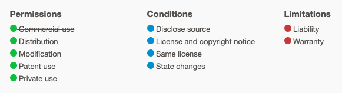

# Music Box Fun

**[musicboxfun.com](https://musicboxfun.com)** — a web app for making music box songs.

For the background on this project, see: [https://www.bryanbraun.com/2019/11/02/music-box-fun](https://www.bryanbraun.com/2019/11/02/music-box-fun)

## Repo Overview

This repo contains three services, each in their own directory:

- `site` - [A static frontend](site), written in plain JavaScript
- `api` - [A backend API](api), using Rails::API and Postgres
- `bot` - [A twitter bot](bot), written in NodeJS

Each service has a README. There are also [some project-wide docs here](/docs).

## Contributing

**First Time Setup**

1. Make sure you have [Docker](https://docs.docker.com/desktop/) and [`make`](https://www.gnu.org/software/make/manual/make.html) installed.
2. To run the frontend, install the local server: `brew install caddy nss`
3. IF you want to run the backend, follow the [backend first-time-setup instructions](api/README.md#setup).
4. IF you want to run frontend tests,
    - Install node/npm
    - Run `npm ci --prefix site`, to download cypress.

**Local development**

To run the services locally, you just need to run the make commands:

- `make dev` - Runs development environments for the main app (`site` and `api`)
- `make stop` - Stops any running environments for the main app (`site` and `api`)
- `make test` - Run tests

For more commands, see the [Makefile](./Makefile).

**Contributing code**

1. Fork the project on Github.
2. Create a feature branch for your changes.
3. Make your changes and commit them to the feature branch.
4. Ensure the tests still pass locally (`make test`)
5. Submit your changes as a PR to the `master` branch of the main repo.

## Credits

- The JavaScript architecture was inspired by [Andy Bell's article on state management in vanilla JavaScript](https://css-tricks.com/build-a-state-management-system-with-vanilla-javascript/).
- The music note icon was based on one from the Noun Project by Hea Poh Lin.
- The play / pause icons were inspired by the ones on the Noun Project.

## License

This project uses the GNU GPLv3 License, amended with [the Commons Clause](https://commonsclause.com/).

This means you get [the terms of the GPLv3](https://choosealicense.com/licenses/gpl-3.0/), excluding the permission to use it for commercial use.

